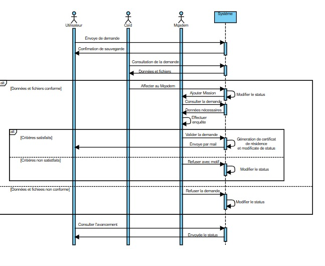
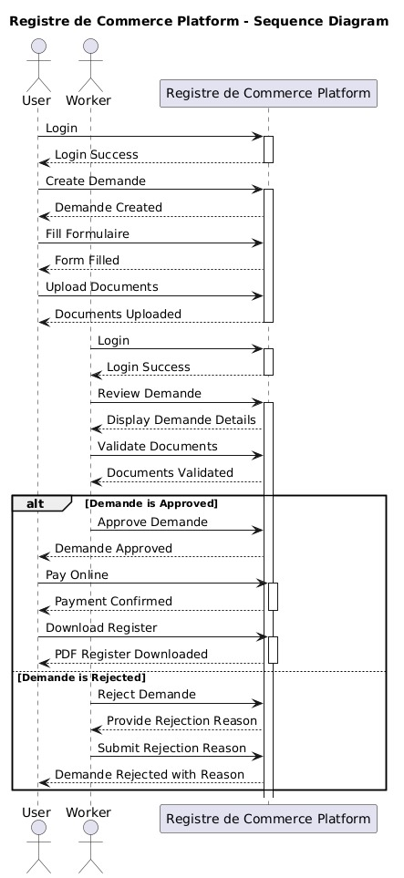
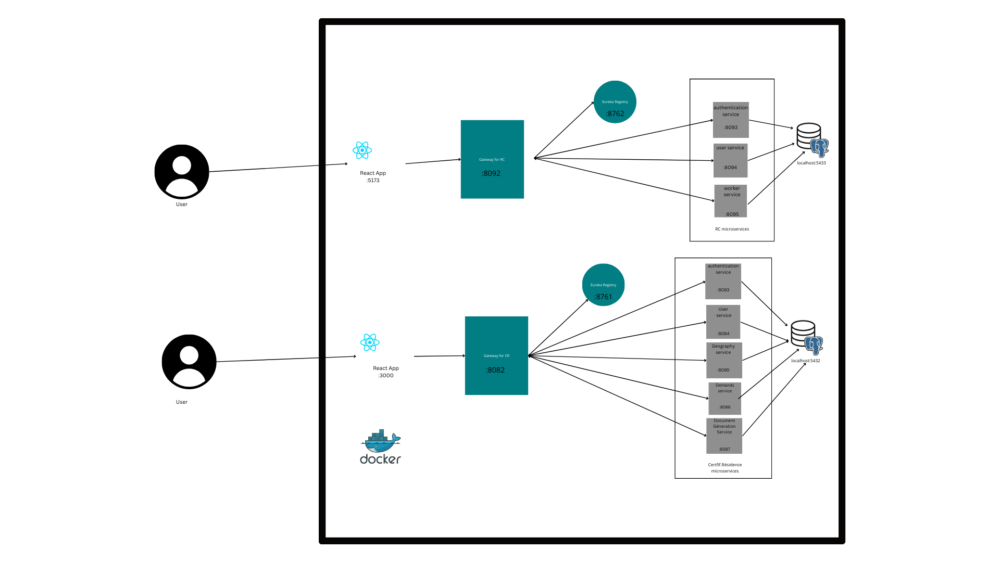

# 🌐 DIGITAL MAROC  2030

La transformation numérique constitue aujourd’hui un enjeu majeur pour les organisations, tant publiques que privées, dans un contexte où l’agilité, l’efficacité et l’innovation sont devenues des facteurs clés de compétitivité. Au Maroc, cette dynamique est encadrée par la stratégie nationale **Digital Morocco 2030**, qui fixe des objectifs ambitieux pour moderniser les systèmes d’information (SI) et promouvoir l’adoption des technologies numériques


## 📋Processus développés

Dans le cadre de la stratégie Digital Morocco 2030, plusieurs améliorations ont été apportées aux **processus d'immatriculation au registre de commerce** *(RCI)* et de **demande d'attestation de résidence** *(ATR)*. Ces changements visent à digitaliser les démarches administratives, les rendant plus rapides, accessibles et transparentes pour les citoyens. 

- **⭐ Processus d'Immatriculation au Registre de Commerce (RCI)**

        ●	Téléchargement des documents en ligne : Les demandeurs peuvent désormais télécharger leurs documents directement sur une plateforme numérique.
        ●	Vérification électronique : Les documents sont vérifiés de manière digitale, améliorant la rapidité du traitement.
        ●	Paiement électronique : Le paiement des frais d'immatriculation est désormais effectué de manière électronique via la plateforme, évitant la nécessité d'un déplacement physique.
        ●	Envoi des documents signés électroniquement : Une fois le processus validé, le certificat est envoyé au demandeur par voie électronique, avec une signature numérique valide.


- **⭐ Processus de Demande d'Attestation de Résidence (ATR)**

        ●	Demande en ligne : Le demandeur peut soumettre sa demande d'attestation de résidence en ligne, en téléchargeant les documents nécessaires.
        ●	Vérification électronique : La vérification des documents se fait également en ligne, assurant une gestion plus rapide.
        ●	Envoi électronique de l'attestation : L'attestation de résidence est envoyée électroniquement, avec une signature numérique, garantissant son authenticité et sa validité.

## Conception 📊
- **Use Case ATR :**

- **Use Case CR :**


## ⚒️ Architecture Logiciel



## </> Technologies Utilisées

-	**Spring Eureka** :
    - Utilisé comme serveur de découverte des microservices, permettant aux services de s'enregistrer dynamiquement et de découvrir les autres microservices dans l'infrastructure. Cela facilite la scalabilité et la gestion des services dans une architecture distribuée.

-	**Docker et Docker Compose** :
    -   Docker est utilisé pour containeriser chaque microservice, garantissant un déploiement cohérent et indépendant des environnements.
    - Docker Compose permet d'orchestrer tous les microservices, simplifiant le démarrage et l'arrêt des services dans l'environnement de développement ou de production.

 **En plus de l’architecture basée sur Spring Eureka et Docker, les technologies suivantes ont été utilisées :**

-	**React (Front-end) :**
    - Pour le développement de l'interface utilisateur des deux plateformes, React a été choisi afin de garantir une expérience utilisateur moderne, interactive et réactive.
    - React permet de créer des composants réutilisables, facilitant ainsi la maintenance et l'évolution des interfaces tout en assurant des performances optimales.

-	**PostgreSQL (Base de Données) :**
    -    PostgreSQL a été utilisé pour le stockage des données des deux processus.
    - C'est une base de données relationnelle robuste et performante, idéale pour gérer des transactions complexes et assurer l'intégrité des données.

-	**RestTemplate (Communication entre Microservices) :**
    - RestTemplate a été utilisé pour permettre la communication entre les différents microservices via des requêtes HTTP RESTful.
    - Cela a facilité l'échange de données entre les services, en assurant une intégration fluide et une interaction efficace dans l’architecture distribuée
- **SpringBoot (Back-end)**


## 🚀 Comment tester l'application ?
- **🔧 Pré-requis** :
    - Docker Desktop 🐳
    - Docker-Compose doit être installé sur votre machine

- **⚙️ Lancer l'application :**
    1. Cloner le dépôt 📥
    ```bash
    git clone https://github.com/Ayuubakb/Urbanisme
    ```
    
    2. Se positionner dans le dossier du projet 📂
    ```bash
    cd Urbanisme
    ```
    3. Se positionner dans le Service Certifiact de résidence 📂
    ```bash
    cd CertificatDeResidence
    ```
    3.1 Construire les conteneurs Docker 🏗️
    ```bash
    docker-compose build
    ```
    3.2. Démarrer les services en arrière-plan 🚀
    ```bash
    docker-compose up -d
    ```

    4. Se positionner dans le Service Registre de commerce 📂
    ```bash
    cd ../RC
    ```

    4.1 Construire les conteneurs Docker 🏗️
    ```bash
    docker-compose build
    ```

    4.2 Démarrer les services en arrière-plan 🚀
    ```bash
    docker-compose up -d
    ```

Après ces étapes, l'application sera prête à être testée sur votre machine via Docker. 

---

## Demo

- **ATR :** 

https://github.com/user-attachments/assets/4d8e890a-a1a9-43f3-9446-21293c511dd1

**E-mail :**


- **RC :**

https://github.com/user-attachments/assets/86211a7a-c20e-4d5b-98d6-0e321a8b5bc7


  


## Acknowledgements

 - [Docker Docs](https://docs.docker.com/)
 - [Postgresql Docs](https://www.postgresql.org/docs/)
 - [React Docs](https://react.dev/)
 - [Docker Images](https://hub.docker.com/)
 - [How to get ATR](https://www.demarchesmaroc.com/certificat-de-residence/)
